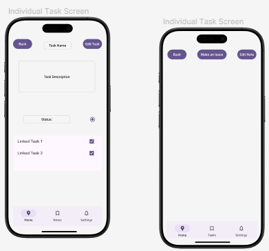
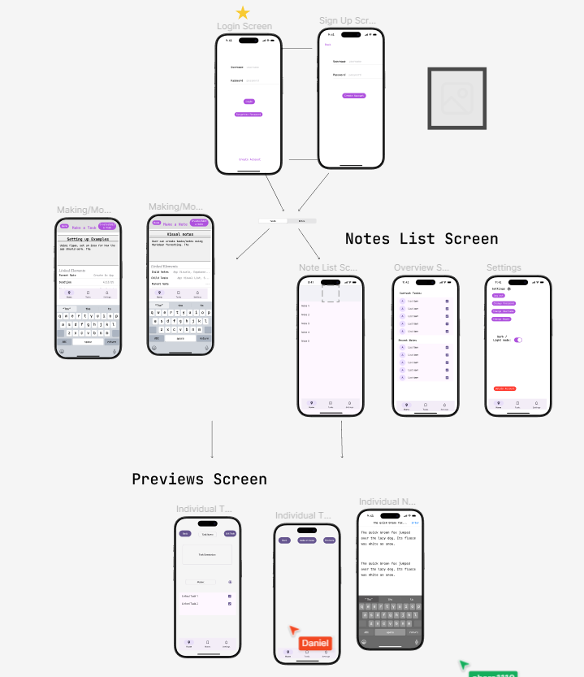
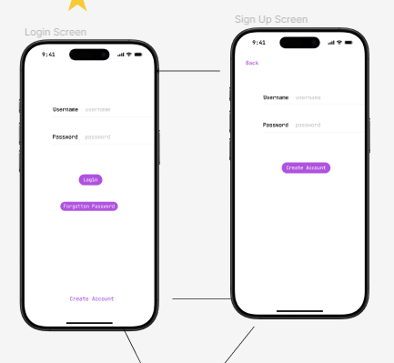
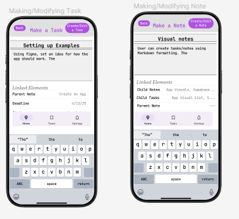
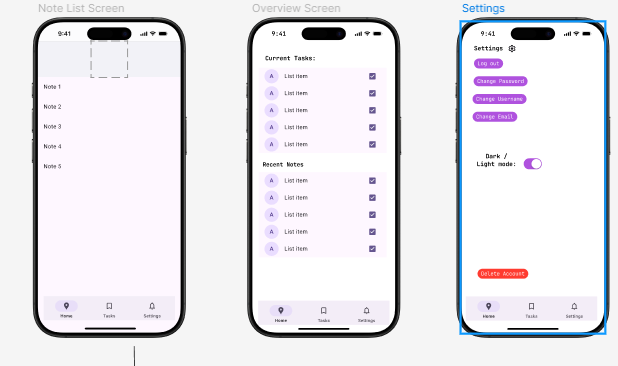

# TaskNotes 

## Table of Contents

1. [Overview](#Overview)
2. [Product Spec](#Product-Spec)
3. [Wireframes](#Wireframes)
4. [Schema](#Schema)

## Overview

### Description

TaskNotes is a lightweight productivity app designed for creatives and developers to efficiently manage tasks and take notes in one place. It combines Markdown-based note-taking with a task management system that supports linking between notes and tasks, helping users stay organized and focused.

### App Evaluation

- **Category:** Productivity
- **Mobile:** Yes
- **Story:**  The goal of TaskNotes is to make a app for creatives/developers that makes it easy to track project process and keep relevant notes together
- **Market:** Developers looking to store notes on/manage tasks
- **Habit:** Meant for daily/frequent use
- **Scope:** Very simplistic app for productivity.

## Product Spec

### 1. User Stories (Required and Optional)

**Required Must-have Stories**

* User can register an account to save their notes
* User can create tasks/notes using Markdown formatting
* Tasks and notes are saved online
* User can add a due by date for tasks
* User can link notes to tasks
* User can link notes with each other

**Optional Nice-to-have Stories**

* User can log in using OAuth (Github & Google)
* User can set reminders to tasks
* User can change the theme of the app (light/dark)
* User can activate haptic feedback for the interface
* Swift Unit tests

### 2. Screen Archetypes

- [ ] **Login Screen**
* Login with username and password
* _Optional: Oauth with Google and github_
- [ ] **Task List Screen**
* List of all the saved tasks, ordered by due date.
* Overdue tasks in a list below
- [ ] **Individual Task Screen**
* Allows the user to see all other linked notes and tasks
* Shows task completion dependent on the completion of other linked tasks
- [ ] **Making/Modifying Task**
* User can edit/make a task on this page
* Allows the user to make/edit a md file to be viewed at a later time
* Allow the user to link other notes/tasks on this page
* Make a system for users that allows them to look up other created notes/tasks for easy linkage
- [ ] **Notes List Screen**
* List of all the saved notes
* Can select a note and view it 
- [ ] **Individual Note Screen**
* Type markdown to make a note 
* Preview to see it rendered, it saves when ever changes are made.
* Can create a task with a top button
* Tasks are written below the note.
- [ ] **Overview Screen**
* See recent notes, and tasks with the most recent due date.

### 3. Navigation

**Tab Navigation** (Tab to Screen)
* Home (Goes to Over view screen)
* Note (Goes to Note list screen)
* Task (Goes to Task list screen)
* Settings (Goes to Settings screen)

## Wireframes

### Screen 1

### Screen 2

### Screen 3

### Screen 4

### Screen 5

## Sprint work!!!

### Sprint 1

#### Making/previewing a md

    
  

#### Making of tests for back end!

    
  

### Sprint 2

#### Sprint 2 report

